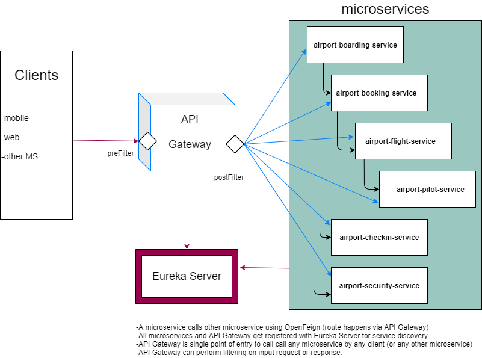
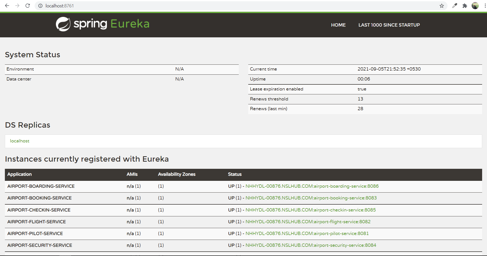
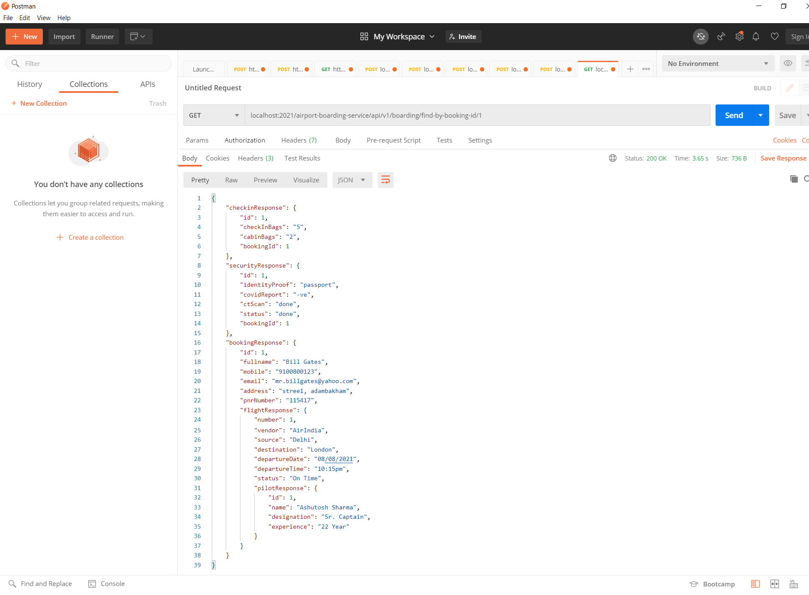

# A comprehensive example on microservices using spring boot with spring cloud

It is a project for airport service. 

In this project we have created six microservices for airport officials and airport passengers. These microservices provides services from passenger's ticket booking to passenger's boarding.

It has two more microservices one for eureka server and one for api gateway.

 

|Microservice|Purpose|Note|     
|----|-----|-----|     
|**airport-pilot-service**|<li>It is a microservice for airport officials</li><li>It is having APIs for PILOT such as create a newPilot, getPilotById, updatePilotById, deletePilotById and findPilotByDesignation</li>|
|**airport-flight-service**|<li>It is a microservice for airport officials</li><li>It is having APIs for FLIGHT such as create a newFlight, getFlightById, updateFlightById, deleteFlightById and searchFlightBySourceAndDestination|This microservice internally calls airport-pilot-service using OpenFiegn to get PILOT details.</li>|
|**airport-booking-service**|<li>It is a microservice for airport flight passengers & airport officials</li><li>It is having APIs for BOOKING such as create a bookingTicket, getBookingByBookingId, findBookingByPNRNumber|This microservice internally calls airport-flight-service using OpenFiegn to get FLIGHT details.</li>|
|**airport-security-service**|<li>It is a microservice for airport officials</li><li>It is having APIs for airport SECURITY check service such as saveNewSecurityChecking, getSecurityById, findSecurityByBookingId</li>|
|**airport-checkin-service**|<li>It is a microservice for airport officials</li><li>It is having APIs for airport CHECKIN service such as saveNewCheckin, getCheckinById, findCheckinByBookingId</li>|
|**airport-boarding-service**|<li>It is a microservice for airport officials</li><li>It is having APIs for BOARDING findBoardingByBookingId|This microservice internally calls airport-booking-service, airport-checkin-service, airport-security-service using OpenFiegn to get BOOKING, CHECKIN, SECURITY CHECK details.</li>|
|**eureka-server**|It is a microservice for service discovery and registry|
|**api-gateway**|It is a microservice work as a gateway (single entry point) for all microservices|

## Microservice Architecture

## Technology Stack
* Spring Boot Starter
	* Web
	* Data JPA
	* Test
	* Actuator
* Spring Cloud
	* Eureka Server [link1](./eureka-server/pom.xml), [link2](./eureka-server/src/main/resources/application.properties), [link3](./eureka-server/src/main/java/com/airport/eureka/server/EurekaServerApplication.java)
	* API Gateway (~~Zuul~~ is deprecated) [link1](./api-gateway/pom.xml), [link2](./api-gateway/src/main/resources/application.properties), [link3](./api-gateway/src/main/java/com/airport/api/gateway/filter/APIGatewayFilter.java)
		* It also provides load balancing so no need to use separate Spring Cloud Load Balancer (~~Ribbon~~ is deprecated)
	* OpenFeign [link1](./airport-flight-service/pom.xml), [link2](./airport-flight-service/src/main/java/com/airport/flight/feignclients/PilotFeignClient.java)
		* A simple alternative to WebClient. ~~RestTemplate~~ is deprecated)
	* Sleuth [link1](./api-gateway/pom.xml), [link2](./airport-pilot-service/pom.xml), [link3](/airport-flight-service/pom.xml), [link4](/api-gateway/src/main/resources/application.properties)
	* Zipkin [link](./snapshots/start-zipkin-server.PNG)
* Resilience4j circuit breaker (~~Hystrix~~ is deprecated) [link1](./airport-flight-service/pom.xml) [link2](./airport-flight-service/src/main/java/com/airport/flight/circuitbreaker/PilotServiceCircuitBreaker.java) [link3](./airport-flight-service/src/main/resources/application.properties)
* OpenAPI (swagger-ui) [link1](./airport-pilot-service/pom.xml), [link2](./airport-pilot-service/src/main/resources/application.properties)
* Lombok
* ModelMapper
* @ControllerAdvice	
	* Exception Handling
		* Global [link](./airport-pilot-service/src/main/java/com/airport/pilot/exception/PilotControllerAdvicer.java)
		* Custom [link1](./airport-pilot-service/src/main/java/com/airport/pilot/exception/PilotCustomException.java), [link2](./airport-pilot-service/src/main/java/com/airport/pilot/service/PilotServiceImpl.java)
* JUnit with Jacocco
	+ Unit Testing
		- for RestController [link](./airport-pilot-service/src/test/java/com/airport/pilot/controller/PilotControllerTest.java)
	+ Code Coverage  [link1](./airport-pilot-service/pom.xml), [link2](./snapshots/how%20to%20run%20code%20coverage.PNG), [link3](./snapshots/output%20of%20code%20coverage.PNG)
* SendMailAPI
* Docker [link1](./airport-pilot-service/Dockerfile), [link2](./snapshots/how%20to%20build%20and%20push%20docker%20images.PNG), [link3](./snapshots/how%20to%20build%20and%20push%20docker%20image%20without%20creating%20Dockerfile.PNG)
* JDK 1.8
* Eclipse IDE
* Maven 
* MySQL RDBMS

## HowTo
**Step 1.** Database Setup
* create schema in MySQL > `CREATE DATABASE airportdb`
* create tables by running [airportdbdump.sql](https://github.com/SirajChaudhary/microservices-using-spring-boot-with-spring-cloud/blob/master/airportdb.sql) in mysql workbench

**Step 2.** Clone the project from [github](https://github.com/SirajChaudhary/microservices-using-spring-boot-with-spring-cloud.git)
> git clone https://github.com/SirajChaudhary/microservices-using-spring-boot-with-spring-cloud.git

**Step 3.** Import into your eclipse IDE

**Step 4.** Update your database credentials in the .properties file wherever it is used in microservices.  

**Step 5.** Run the microservices in the following sequence.
* eureka-server
* api-gateway
* all microservices one by one in any sequence

**Step 6.** Run APIs (microservices) using OpenAPI (Swagger-UI) or Postman Client in the following sequence.
* airport-pilot-service
* airport-flight-service
* airport-booking-service
* airport-security-service
* airport-checkin-service
* airport-boarding-service

**Step 7 (optional).** Run Zipkin Server to trace Sleuth logs on GUI.
* download and install zipkin server and then [run the zipkin server](./snapshots/start-zipkin-server.PNG). Here is the [zipkin server console output](./snapshots/run-zipkin-server-and-trace-any-sleuth-request.PNG)

## Snapshots
### `Eureka Server`
**http://localhost:8761/**

### `OpenAPI (swagger-ui)`
It will be used just for testing purpose. It won't route via API Gateway. We run like an independent swagger-ui of each microservice.

* [http://localhost:8081/swagger-ui.html](./snapshots/airport-pilot-service-swagger-ui.PNG)

* [http://localhost:8082/swagger-ui.html](./snapshots/airport-flight-service-swagger-ui.PNG)

* [http://localhost:8083/swagger-ui.html](./snapshots/airport-booking-service-swagger-ui.PNG)

* [http://localhost:8084/swagger-ui.html](./snapshots/airport-security-service-swagger-ui.PNG)

* [http://localhost:8085/swagger-ui.html](./snapshots/airport-checkin-service-swagger-ui.PNG)

* [http://localhost:8086/swagger-ui.html](./snapshots/airport-boarding-service-swagger-ui.PNG)

### `Postman`
API calls will route via API Gateway (2021) only!

* [An API to create a new pilot](./snapshots/airport-pilot-service-create-new-pilot.PNG)  
> **URL:** localhost:2021/airport-pilot-service/api/v1/pilot  
**Method:** POST  
**RequestBody:** {
    "name": "Ashutosh Sharma",
    "designation": "Sr. Captain",
    "experience": "22 Year"
}

* [An API to create a new flight](./snapshots/airport-flight-service-create-new-flight.PNG)  
> **URL:** localhost:2021/airport-flight-service/api/v1/flight  
**Method:** POST  
**RequestBody:** {
  "vendor": "AirIndia",
  "source": "Delhi",
  "destination": "London",
  "departureDate": "08/08/2021",
  "departureTime": "10:15pm",
  "status": "On Time",
  "pilotId": 1
}

* [An API to create a new booking](./snapshots/airport-booking-service-create-new-booking.PNG)  
> **URL:** localhost:2021/airport-booking-service/api/v1/booking  
**Method:** POST  
**RequestBody:** {
  "fullname": "Bill Gates",
  "mobile": "9100800123",
  "email": "mr.billgates@yahoo.com",
  "address": "stree1, adambakham",
  "flightNumber": 1
}

* [An API to create a new security check](./snapshots/airport-security-service-create-new-security.PNG)  
> **URL:** localhost:2021/airport-security-service/api/v1/security  
**Method:** POST  
**RequestBody:** {
    "identityProof": "passport",
    "covidReport": "-ve",
    "ctScan": "done",
    "status": "done",
    "bookingId": "1"
}

* [An API to create a new checkin](./snapshots/airport-checkin-service-create-new-checkin.PNG)  
> **URL:** localhost:2021/airport-checkin-service/api/v1/checkin  
**Method:** POST  
**RequestBody:** {
  "checkInBags": "5",
  "cabinBags": "2",
  "bookingId": "1"
}

* [An API to get complete details of a boarding](./snapshots/airport-boarding-service-get-a-boarding-details.PNG)  
> **URL:** localhost:2021/airport-boarding-service/api/v1/boarding/find-by-booking-id/1  
**Method:** GET  

**Similarly there are a bunch of APIs (e.g. create/read/update/delete/findByXXX) in each microservice which you can explore yourself easily.** 

## License
Free Software, by [Siraj Chaudhary](https://www.linkedin.com/in/sirajchaudhary/) 
